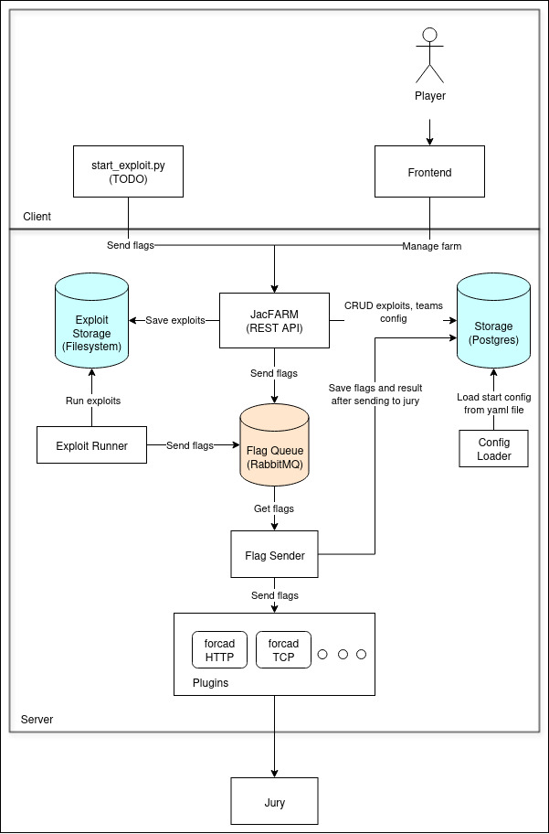
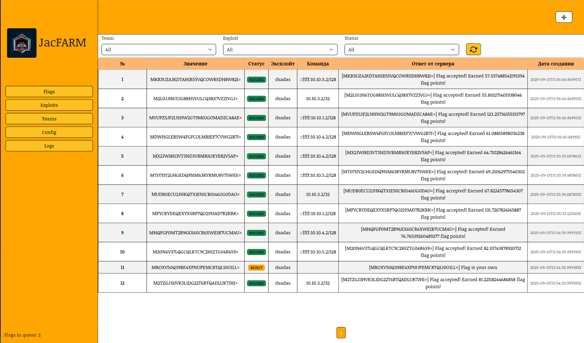

# JacFARM

Exploit farm for attack-defense CTF competition

## Components

### Arch Diagram

### Server

- **Exploit Runner** - a worker that launches exploits on all teams. [More details](./docs/exploit_runner/exploit_runner.md)
- **Flag Sender** - a worker that sends flags to jury using *Plugins*. [More details](./docs/flag_sender/flag_sender.md)
- **JacFARM API** - API for frontend and cli start_exploit.py.
- **Config Loader** - loads config into db from config.yml on start. Next configuration editing is available through the frontend.

### Client

- **start_exploit.py** - python cli tool for starting exploits on local machine (TODO)
- **Frontend**
