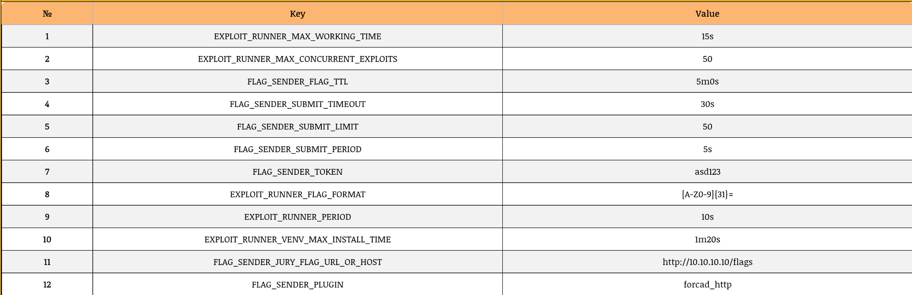

# Config

## Start configuration

The initial farm configuration is located in **config.yml** and must be configured before starting the farm.

You have to change:

### Section exploit_runner

1. Vulnboxes ip addresses (target ip addresses for exploits).
This can be done in one of four ways (you can remove unnecessary fields from config.yml):
  - **team_ips** - list of IP addresses of team vulnboxes
  - **team_ip_cidrs** - cidrs of team vulnboxes
  - **team_ip_ranges** - range of team vulnboxes
  - **team_ip_from_N** - range of team vulnboxes calculating by formula for template like "10.{X}.{Y}.2"
    - N - range(**n_start**, **n_end**)
    - X = N / **block** + **offset_x**
    - Y = N % **block** + **offset_y**
2. **flag_format** - format of flag in CTF competition. This regular expression will extract flags from the exploit text

### Section flag_sender

1. **plugin** - module for sending flags in jury system
2. **jury_flag_url_or_host** - url or host of jury system where the flags will be sent
- For HTTP plugins should be url like: http://example.com/flags or http://1.2.3.4:5555/flags
- For TCP plugins should be hostname + port like: example.com:5555 or 1.2.3.4:5555
3. **token** - auth token for jury system (if needed)
4. **flag_ttl** - time to live of flags

## Real-time configuration

All settings of this configuration can be changed in real-time in ui. The exception is parameter **plugin** in section **flag_sender**. To change it, you need to restart the farm.

It is also not recommended to add ip addresses via the ui, as there is no option for bulk addition.

